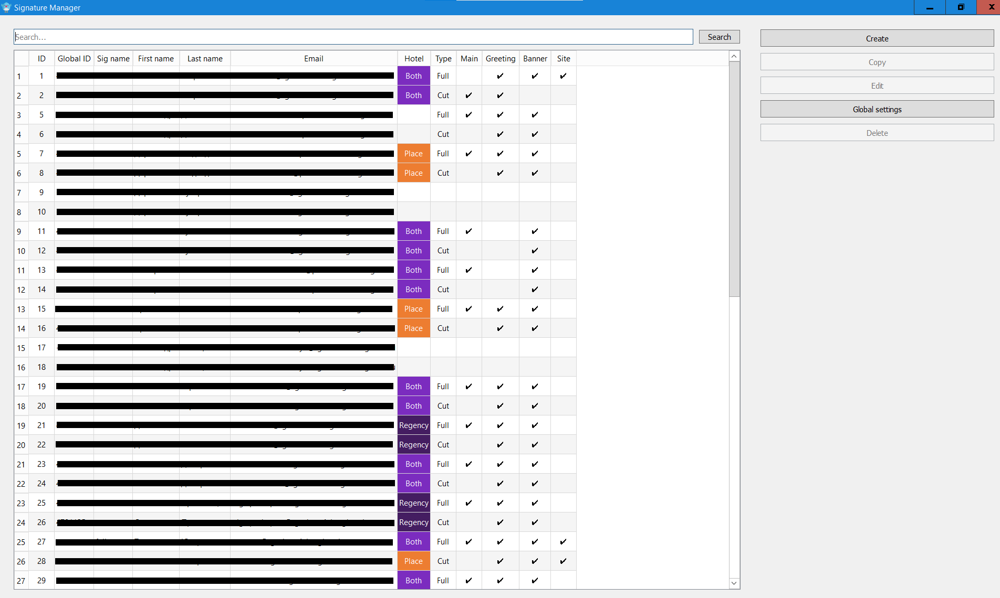
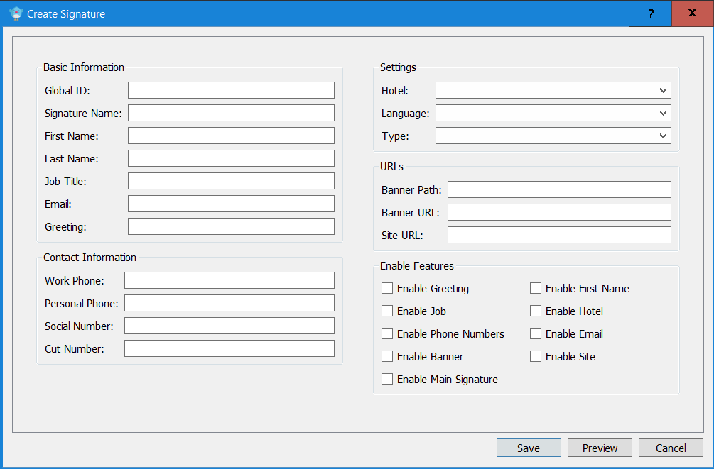
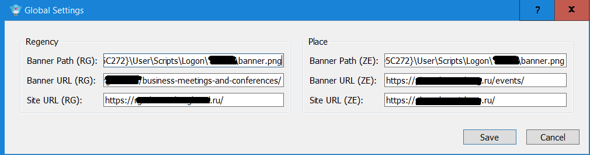

# Outlook Signature Auto-Updater

Система для автоматического обновления подписей Outlook в корпоративной среде.

## Описание

Скрипт автоматически генерирует и устанавливает email-подписи для сотрудников на основе данных из базы данных SQL. Работает в фоновом режиме через системный трей, периодически проверяет обновления и применяет их к Outlook.

## Основные возможности

- **Автоматическое обновление** подписей по расписанию
- **Интеграция с Active Directory** (определение текущего пользователя)
- **Поддержка нескольких отелей/брендов** с разными цветовыми схемами
- **Многоязычность** (русский/английский)
- **Гибкая настройка** через конфигурационный файл
- **Работа в системном трее** с уведомлениями
- **Черный список пользователей** (исключение определенных учетных записей)
- **Поддержка баннеров** (изображения в подписи)

## Требования

### Системные требования
- windows
- microsoft outlook
- python

### Необходимые пакеты
```bash
pip install -r requirements.txt
```

## Интерфейс программы

### Главное окно


### Окно создания пользователя


### Окно глобальных настроек



